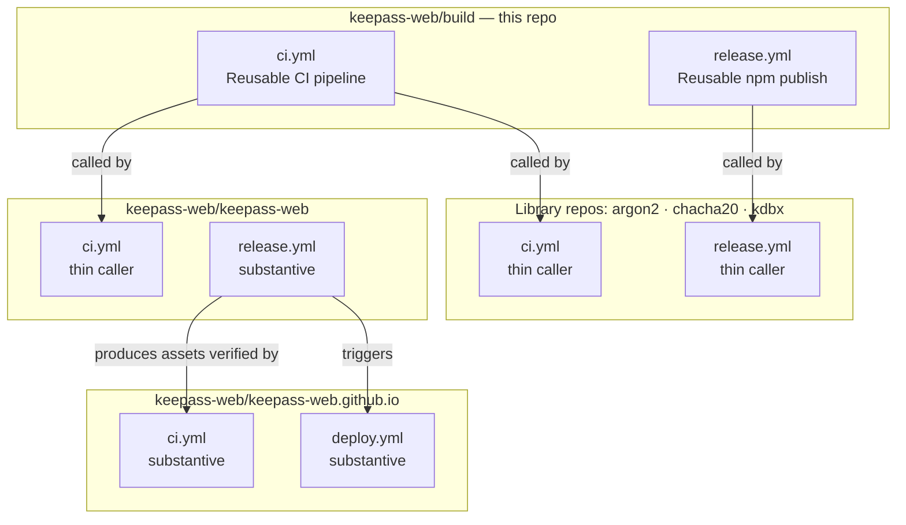
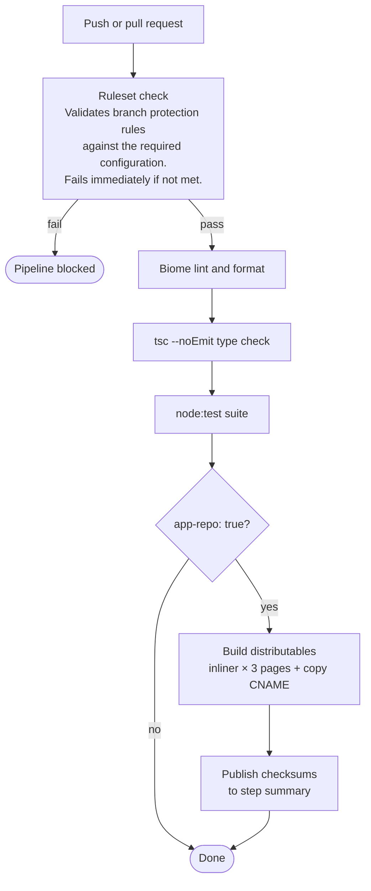
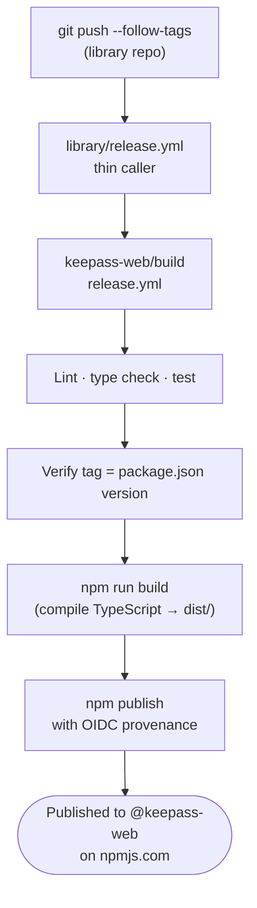
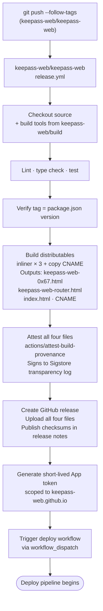
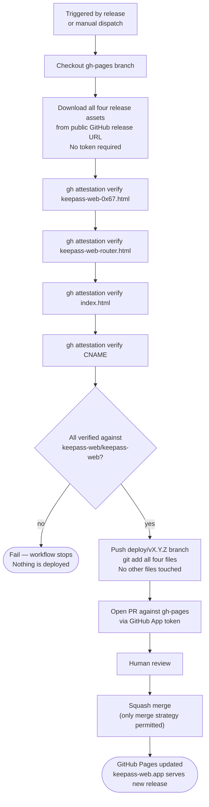
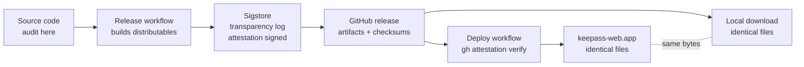

# Pipeline

This document maps the complete build, release, and deploy pipeline across all
KeePass Web repositories. It exists so that a reader auditing this repo has a
full picture of where every piece of pipeline code lives — including the pieces
that do not live here.

---

## Workflow inventory

Two workflows live in this repo and are consumed by all others as reusable
workflows. Everything else is substantive workflow code that lives in the repo
it belongs to.

| Workflow | Location | Type |
|---|---|---|
| CI pipeline | `keepass-web/build/.github/workflows/ci.yml` | Reusable — called by all repos |
| Library npm publish | `keepass-web/build/.github/workflows/release.yml` | Reusable — called by library repos |
| App release | `keepass-web/keepass-web/.github/workflows/release.yml` | Substantive — not a caller |
| Deploy | `keepass-web/keepass-web.github.io/.github/workflows/deploy.yml` | Substantive — not a caller |
| Deploy verification | `keepass-web/keepass-web.github.io/.github/workflows/ci.yml` | Substantive — not a caller |

The thin `ci.yml` and `release.yml` in each library repo delegate entirely to
this repo and contain no logic of their own. They exist because GitHub Actions
requires the triggering workflow to reside in the repo that owns the event.

### Why the app release and deploy workflows do not live here

The reusable CI and library release workflows are genuinely generic — every
library does the same thing. The app release workflow builds specific
distributables from a specific source layout and attests specific artifact
names. The deploy workflow downloads those specific files, verifies them, and
deploys to a specific GitHub Pages repo. Neither workflow can be meaningfully
parameterised without becoming as complex as the code it replaces.

The practical consequence: to audit the complete pipeline, a reader must read
three locations — this repo, `keepass-web/keepass-web`, and
`keepass-web/keepass-web.github.io`. This document links each.

---

## Architecture

---

## CI pipeline

Runs on every push and pull request in every repository. Defined in
`ci.yml` in this repo; each repository's thin `ci.yml` calls it.

---

## Library release pipeline

Runs when a `v*` tag is pushed to a library repo (`argon2`, `chacha20`,
`kdbx`). The thin `release.yml` in each library calls the reusable workflow
defined in this repo.

npm trusted publishing (OIDC) is used: no `NPM_TOKEN` is stored. The trusted
publisher on npmjs.com is configured against the **caller** repo and workflow
(`keepass-web/<repo> → release.yml`), not this reusable workflow.

---

## App release pipeline

Runs when a `v*` tag is pushed to `keepass-web/keepass-web`. Defined entirely
in `keepass-web/keepass-web/.github/workflows/release.yml` — not a caller of
any reusable workflow in this repo.

---

## Deploy pipeline

Runs automatically after a release, or manually via Actions → Deploy →
Run workflow. Defined entirely in
`keepass-web/keepass-web.github.io/.github/workflows/deploy.yml`.

Every file committed to `gh-pages` is a verbatim copy of a release artifact.
Nothing is created or modified during deployment.

### Deploy PR verification

Every PR targeting `gh-pages` runs `keepass-web.github.io/ci.yml`, which
verifies the distributables before the PR can be merged. Checksum verification
against the published release is [not yet implemented](https://github.com/keepass-web/keepass-web.github.io/blob/main/.github/workflows/ci.yml).

---

## Attestation and the trust chain

A file on keepass-web.app and a file downloaded from the GitHub release are the
same bytes. Trust established by auditing the source and verifying the
attestation transfers to both without qualification.
